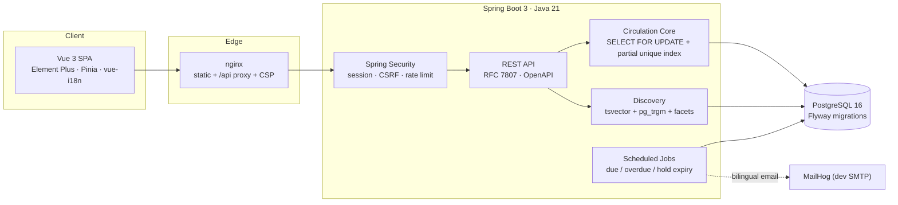

<div align="center">

# Libris

**现代化的双语图书馆管理系统 · A modern bilingual Integrated Library System**

[](https://github.com/ada-zf1225/libris/actions/workflows/ci.yml)
[](LICENSE)


</div>

Libris 是一个单馆规模的图书馆管理系统,产品形态对标学术图书馆的业界标准 Ex Libris **Primo**(读者发现层)与 **Alma**(馆员流通后台):全文检索与分面过滤、单册级实时在馆状态、完整的流通工作流(借/还/续/预约/罚款)、读者自助的 My Library,以及馆员流通台、政策引擎与运营仪表盘。全站中英双语。

Libris is a single-branch Integrated Library System whose product shape follows Ex Libris **Primo** (discovery) and **Alma** (fulfilment): full-text search with facets, per-copy real-time availability, the complete circulation workflow (loans, renewals, holds, fines), patron self-service, a staff circulation desk, a policy engine and an operations dashboard. Fully bilingual (中文 / English).

## ✨ 功能 · Features

| 读者端 Patron | 馆员端 Staff |
|---|---|
| 🔍 全文 + 模糊检索、分面过滤、输入建议<br>Full-text & fuzzy search, facets, suggestions | 🏛 流通台:扫码借还续、归还智能路由(上架/预约架)<br>Circulation desk with barcode workflows & routing |
| 📖 单册级实时在馆状态与到期日<br>Real-time per-copy availability | 📚 书目 + 单册两级馆藏管理,条码序列分配<br>Bibliographic records & item copies |
| 🔖 预约队列:到馆通知、7 天取书期、过期顺延<br>FIFO holds with pickup window & expiry promotion | ⚙️ 按读者类型配置的流通政策(借期/上限/罚率/封锁阈值)<br>Configurable loan policies |
| 📅 My Library:借阅/一键续借/历史/罚款/收藏/荐购<br>Loans, renewals, history, fines, favourites, suggestions | 🚫 实时借阅限制 + 定时自动封锁<br>Real-time blocks & scheduled escalation |
| 🔔 站内通知 + 双语邮件(到期/逾期/到书)<br>In-app + bilingual email notices | 📊 运营仪表盘(趋势/热门/分类占比/逾期率)与审计日志<br>Operations dashboard & audit log |
| 📄 论文库(真实 DOI)、BibTeX 导出<br>Paper collection with real DOIs, BibTeX export | ✅ 荐购审批流<br>Purchase-suggestion approvals |

## 🏗 架构 · Architecture



**关键设计 · Key decisions**

- **并发正确性**:每次流通操作对单册行加 `SELECT … FOR UPDATE`;`loans(copy_id) WHERE returned_at IS NULL` 部分唯一索引作为数据库层兜底 —— 一册书在任何时刻只可能有一条活跃借阅(有 8 线程竞争的集成测试)。
- **检索**:PostgreSQL `simple` tsvector 负责词元匹配,`pg_trgm` 相似度承担中文子串与容错;分面在过滤后的结果集上聚合。演进路线(zhparser / Elasticsearch)见 issues。
- **政策引擎**:借期、上限、续借次数、日罚率、封锁阈值全部按读者类型存于数据库,馆员可在线调整。
- **安全**:BCrypt、登录限流、会话轮换、SPA CSRF、URL+方法级 RBAC、属主校验、RFC 7807 无堆栈泄露、Dependabot + 分支保护 + 必须绿的 CI。详见 [SECURITY.md](SECURITY.md)。
- **真实数据**:62 种真实书目(真实 ISBN,封面经 Open Library)、10 篇经典论文(真实 DOI)、中图法 22 大类双语。演示读者为虚构账号。

## 🚀 快速开始 · Quick Start

```bash
git clone https://github.com/ada-zf1225/libris.git
cd libris
docker compose up --build
```

| 入口 | 地址 |
|---|---|
| 应用(SPA + API) | http://localhost:8081 |
| API / Swagger UI | http://localhost:8080/swagger-ui.html |
| MailHog(通知邮件) | http://localhost:8025 |

**演示账号 · Demo accounts**

| 角色 | 用户名 | 密码 |
|---|---|---|
| 馆员 Staff | `admin` | `LibrisAdmin#2026` |
| 读者 Reader(教师) | `zhanghua` | `LibrisReader#2026` |
| 读者 Reader(学生) | `zhangminghua` | `LibrisReader#2026` |

### 本地开发 · Local development

```bash
docker compose up postgres mailhog          # 数据库 + 邮件捕获
cd backend && ./mvnw spring-boot:run        # API :8080(Flyway 自动建库)
cd frontend && pnpm install && pnpm dev     # SPA :5173(代理 /api)
```

测试(Testcontainers 需本机 Docker):

```bash
cd backend && ./mvnw verify                 # 16 项集成测试,含并发竞争
cd frontend && pnpm lint && pnpm build
```

## 📐 设计边界 · Scope

单馆系统,以下能力**有意**不做(需要馆间网络或行业数据源):馆际互借/文献传递、MARC 编目、电子资源链接解析、多馆多流通台、真实支付网关(罚款支付为模拟)、短信通道、引文网络。长期路线见 [Issues backlog](https://github.com/ada-zf1225/libris/issues?q=label%3Abacklog)。

Deliberately out of scope for a single-branch system: ILL/document delivery, MARC cataloguing, link resolvers, multi-branch circulation, real payment gateways (fine payment is simulated), SMS, citation graphs.

## 🛠 工程实践 · Engineering

- 主干受保护:PR + 三项 CI 必绿(后端 Testcontainers 集成测试、前端 lint + 类型检查 + 构建、仓库卫生)→ squash merge
- [Conventional Commits](https://www.conventionalcommits.org/) · 里程碑制迭代(M1 基础 → M5 发布)· Dependabot 供应链更新
- 集成测试跑在真实 PostgreSQL(Testcontainers)上:流通全生命周期、同册并发竞争、鉴权矩阵、检索相关性、预约过期顺延、定时任务

## 📄 License

[MIT](LICENSE) © 2026 Fan Ziheng
